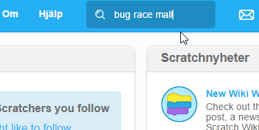
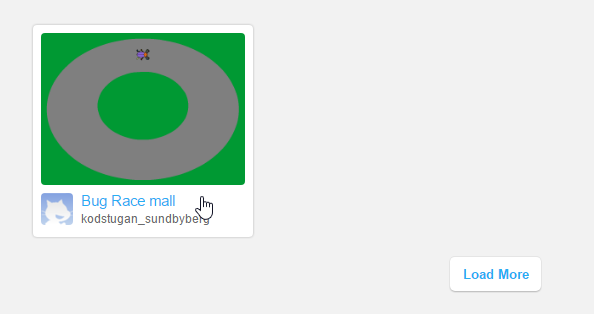
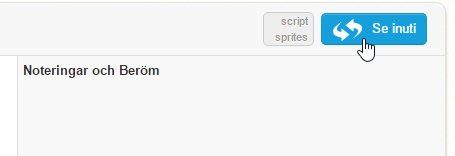
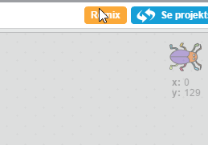
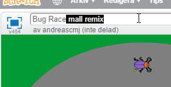

# Bug Race (intro)

Nu ska du få  skapa ett roligt spel som är enkelt även om du aldrig har jobbat med Scratch tidigare. Målet är att få en skalbagge att springa runt en bana och försöka undvika att hamna utanför banan genom att styra med vänster- och högerpil på tangentbordet.

Ett exempel på det färdiga spelet kan du se  <a href="https://scratch.mit.edu/projects/27697024/" target="_blank">här på Scratch</a>

För att lite snabbare komma till programmeringen kommer vi använda ett projekt som redan är påbörjat.

## Delmoment 1: Hitta projektet att remixa

Klicka i sökfältet på startsidan och sök efter Bug Race Mall.

I sökresultatet finns det ett projekt som kodstugan_sundbyberg har lagt upp. Klicka på det.

Du kan nu se projektet. För att se vad som finns inuti projektet, klicka på Se inuti-knappen.

Som du ser är projektet tomt, förutom att det finns en skalbagge och en bana. Det är därför dags att lägga till lite skript så att något händer.

## Delmoment 2: Remixa projektet

För att kunna ändra någon annans projekt så måste du klicka på remix-knappen högst uppe i högra hörnet.

Projektet kommer nu ha fått namnet Bug Race mall remix. Markera namnet och byt ut det till det du vill, till exempel Mitt Bug Race.

## Delmoment 3: Ditt första skript

Nu när du lyckats remixa projektet kan du börja skapa ditt första skript. Glöm inte att **spara** ofta!

Börja med att dra skalbagge-sprajten till den målade banan (som på bilden ovanför). Tryck på SKRIPT-fliken om den inte redan är vald.

Har du lagt märke till START- och STOPP-knappen än? Se om du kan hitta dem.
Det första du ska göra är att se till att skalbaggen rör sig när du trycker på START. För att göra det måste du lägga till ditt första skript som säger:

"När jag trycker på START, ska skalbaggen röra sig."

7. Dra ut ett block för **HÄNDELSER**: "när START (flaggan) klickas på" till skriptytan.  Under den kopplar du fast blocket för **RÖRELSE**: **"gå 10 steg"**.

  

  _Tryck först på Händelser och dra sedan ut "när START klickas på" till fönstret till höger._

  

  _Tryck på Rörelse och dra sedan ut "gå 10 steg" och placera den som på bilden._

> Testa nu vad som händer när du trycker på START. Skalbaggen flyttar sig åt höger! Det är bra, men du vill ju att skalbaggen skall röra sig framåt hela tiden. Hur gör du det?

8. Det kan du ordna med skriptet **"för alltid"** som finns under rubriken **KONTROLL**.
Det här är en LOOP som gör att sprajten fortsätter röra sig så länge programmet är igång.

  

  _För att skalbaggen ska fortsätta att gå måste du lägga "gå 10 steg" i mitten av "för alltid"-loopen. "Gå 10 steg" kommer då att upprepas för alltid._

> Testa att trycka på START. Nu blir det fart på skalbaggen! Prova vad som händer om du ändrar antalet steg till en lägre siffra. Välj en hastighet som du tror är lagom för att kunna styra skalbaggen.

## Delmoment 4: Sätt en Startposition

För att slippa dra tillbaka skalbaggen varje gång du trycker på START kan du säga åt datorn att placera den på en särskild plats varje gång du startar spelet. Detta kallas för att initiera programmet, du gör ett INIT-SKRIPT som berättar för datorn hur programmet ska starta.

Innan du gör ditt skript, flytta skalbaggen till en startposition som du väljer själv.

9. Välj från **RÖRELSE** **"gå till x: y:"** och koppla fast direkt under flaggan, innan loopen. De värden som står för X och Y är KOORDINATER för den startposition som du har ställt skalbaggen på.  

  

Nu kommer skalbaggen automatiskt att flyttas till sin startposition varje gång du trycker på flaggan, utan att du behöver dra den dit själv!

## Delmoment 5: Styra skalbaggen

Nästa steg blir att göra det möjligt att styra skalbaggen! För det behöver du två små skript. Ett som säger åt datorn att svänga höger på skalbaggen när du trycker ned höger piltangent, och ett annat som säger åt den att svänga vänster när du trycker ned vänster piltangent.

10. Under **HÄNDELSER** finns ett block som säger **"när mellanslag trycks ned"**. Dra två sådana block och lägg var som helst på skriptytan. Ändra den ena till **vänsterpil** och den andra till **högerpil**, du väljer i rullistan.

11. Koppla fast ett skript under varje block; under **RÖRELSE** hittar du ett som säger **"vänd (pil vänster) 15 grader"** och ett som säger **"vänd (pil höger) 15 grader"**.

  

> Testa vad som händer nu när du trycker på START. Du kan styra skalbaggen åt båda hållen med piltangenterna!

## Delmoment 6: Ändra startriktning

Om du trycker på START igen märker du att skalbaggen behåller den riktning som den hade när du slutade sist. Det kan du lösa genom att lägga in ett till init-skript som säger åt datorn att skalbaggen alltid ska vara vänd åt höger när du startar spelet.

12. Välj blocket som säger **"peka i 90 riktning"** från **RÖRELSE**. Testa vad som händer om du ändrar på värdet från 90 grader till något annat. Det står även en hjälptext i rullistan när du väljer riktning.

  

## Delmoment 7: Känna av gräset

Nästa steg är att skapa ett skript som gör att skalbaggen känner av när den hamnar utanför din utmålade bana. Hur ska den kunna göra det? Det kan du lösa med ett skript som känner av vilken färg som skalbaggen rör sig över. Du behöver skapa ett VILLKOR för skalbaggen: OM skalbaggen rör vid färgen grön betyder det att den har åkt av banan, och DÅ ska spelet ta slut - Game Over!

13. Välj blocket "**om <> då**" som finns under **KONTROLL**. Det här blocket säger att OM det som står i **<>** händer, DÅ ska något annat hända. Om skalbaggen rör färgen grön, säg Game Over!

14. Under **KÄNNA AV** finns blocket "**Rör färgen <> ?"**. Dra den till **<>**, tryck på den lilla fyrkanten och sedan på ditt gräs. Den lilla fyrkanten får nu samma gröna färg som gräset.

  

15. Till sist skapar du ett skript för att spelet ska säga att spelet är över om skalbaggen nuddar den gröna färgen. Välj **"säg ___ i 2 sekunder"** under **UTSEENDE**, dra in det innanför "**om <**"**Rör färgen grön?> då**" och ändra texten till det du vill ska stå.

> Testa ditt spel! Händer något när skalbaggen nuddar det gröna gräset? Om inte, vad tror du att det kan bero på?

## Delmoment 8: Göra klart skriptet

Något saknas! När vill du att datorn ska känna av om skalbaggen nuddar det gröna gräset? Det behöver göras efter varje steg skalbaggen tar, för att inte missa att den hamnar utanför banan. Därför måste du slå ihop skriptet som känner av gräset med skriptet som får skalbaggen att röra sig.

16. Lägg skriptet som känner av den gröna färgen, in i din "för alltid"-loop.

17. Lägg till **"stoppa detta skript"**, under **KONTROLL**, om skalbaggen springer av banan. På så sätt avslutas spelet och det går inte längre att styra skalbaggen.

## Färdig!
Grattis, nu har du skapat ditt första spel! Det färdiga skriptet i sin helhet borde se ut så här:

**Glöm inte att spara ditt projekt!** Döp det gärna till uppgiftens namn så att du enkelt kan hitta den igen.

> **Testa ditt projekt**  
Visa gärna någon det som du har gjort och låt dem testa. Tryck på DELA för att andra ska kunna hitta spelet på Scratch. Gå ut till projektsidan och låt någon annan testa spelet!

## Utmaning
Saknas något? Hur skulle du vilja utveckla spelet?

Det får du göra i nästa uppgift!

## Frågeställningar

* Vad är en sprajt?

* Vad är en loop? 

* Varför kan det vara bra att använda en loop?

* Vad är ett INIT- eller Start-Skript?

* Vad händer i spelet om sprajten har samma färg som bakgrunden?
